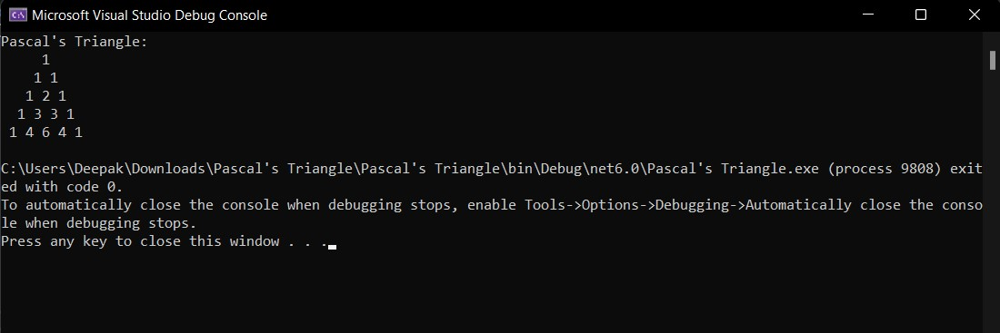

# Pattern

## Aim:
To write a C# program for a pascal's triangle.

## Equipment Required:
1.Hardware-PC

2.Visual Studio Code 2022.

## Algorithm:
## Step 1:
Start.

## Step 2:
Create a class and declare two variables rows,Val using integer datatype.

## Step 3:
Using nested for loop we can create a pascal's triangle according to the value intialised.

## Step 4:
Stop.


## Program:
```
Program Developed by: R.SOMEASVAR
Register Number: 212221230103
```
```
using System;
namespace PascalsTriangle
{
    class pattern
    {
        public static void Main(string[] args)
        {
            int rows = 5, value = 1, blank, i, j;
            Console.WriteLine("Pascal's Triangle:");
            for(i=0; i<rows; i++)
            {
                for (blank = 1; blank <= rows - i; blank++)
                {
                    Console.Write(" ");
                }
                    for(j=0;j<=i;j++)
                    {
                        if (i == 0 || j == 0)
                            value = 1;
                        else
                            value = value * (i - j + 1) / j;
                        Console.Write(value + " ");
                    }
                    Console.WriteLine();
                }
            }
        }
    }

```

## Output:


## Result:
Thus the C# program to print the pascal's triangle is executed successfully.
